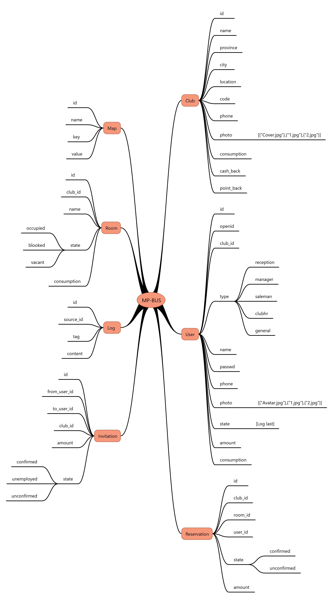

## 结构


## 键值对

### 获取键值

> **GET** /maps/{key}

### 请求参数

| 参数 | 必须 | 类型 | 说明 |
| -------- | -------- | -------- | -------- |
| key     | Y     | string     | 键名     |

### 返回结果
```
{
    "id": 1,
    "tag": "", //键值对别名
    "key": "a", //键名
    "value": "123", //键值
    "created_at": "2016-11-30 12:49:38",
    "updated_at": "2016-11-30 12:49:38"
}
```
### 设置键值

> **POST** /maps/{key}

### 请求参数


| 参数 | 必须 | 类型 | 说明 |
| -------- | -------- | -------- | -------- |
| key     | Y     | string     | 键名     |
| value     | Y     | string     | 键值     |
| tag     | N     | string     | 用于注释用途     |


### 返回结果
```
{
    "id": 1,
    "tag": "变量a", //键值对别名
    "key": "a", //键名
    "value": "123", //键值
    "created_at": "2016-11-30 12:49:38",
    "updated_at": "2016-11-30 12:49:38"
}
```
*注意：以下划线开头的key为系统保护键值不可以获取*


## 上传图片

> **POST** /upload

### 请求参数

| 参数 | 必须 | 类型 | 说明 |
| -------- | -------- | -------- | -------- |
| file     | N     | file     | 文件     |
| base64   | N     | string     | base64     |

*file / base64 二选一*
### 返回结果
```
{
    "result": true, //上传结果
    "path": "uploads\\583ee01df141b.jpg", //文件路径
    "msg": "" //返回消息
}
```


## 用户

### 创建用户

> OpenID认证时自动创建

### 获取用户信息

> **GET** /users/{id}

### 请求参数

| 参数 | 必须 | 类型 | 说明 |
| -------- | -------- | -------- | -------- |
| id     | Y     | int     |      |

### 返回结果
```
{
    "result": true,
    "user": {
        "id": 1,
        "club_id": 1, //会所id
        "role": "", //用户类型 [reception:前台 manager:经理 saleman:销售 clubhr:会所HR 空:普通用户(未指定类型)]
        "name": "abc", //用户名字
        "phone": "18149540000", //用户手机
        "photo": "[{"Avatar.jpg"},{"1.jpg"},{"2.jpg"}]", //用户照片json 第一张为头像或封面
        "state": "", //用户状态 [free:空闲 working:工作中]
        "amount": 0, //用户余额
        "point": 0, //积分
        "consumption": 100, //最低消费
        "created_at": "2016-12-01 05:24:23",
        "updated_at": "2016-12-02 09:27:50"
    }
}
```
### 更新用户信息

> **PUT** /users/{id}

### 请求参数

| 参数 | 必须 | 类型 | 说明 |
| -------- | -------- | -------- | -------- |
| openid     | N     | int     | 微信openid     |
| club_id     | N     | int     | 所属会所     |
| role     | N     | string     | 用户类型     |
| name     | N     | string     | 名字     |
| passwd     | N     | string     | 密码 md5(pass)     |
| phone     | N     | string     | 手机     |
| photo     | N     | string     | 照片     |
| state     | N     | string     | 用户状态     |
| consumption     | N     | double     | 最低消费     |


### 返回结果
```
{
    "result": true,
    "user": {
        "id": 1,
        "club_id": 1, //会所id
        "role": "", //用户类型 [reception:前台 manager:经理 saleman:销售 clubhr:会所HR 空:普通用户(未指定类型)]
        "name": "abc", //用户名字
        "phone": "18149540000", //用户手机
        "photo": "[{"Avatar.jpg"},{"1.jpg"},{"2.jpg"}]", //用户照片json 第一张为头像或封面
        "state": "", //用户状态 [free:空闲 working:工作中]
        "amount": 0, //用户余额
        "point": 0, //积分
        "consumption": 100, //最低消费
        "created_at": "2016-12-01 05:24:23",
        "updated_at": "2016-12-02 09:27:50"
    }
}
```
### 获取Oauth Code
> https://open.weixin.qq.com/connect/oauth2/authorize?appid={APPID}&redirect_uri={REDIRECT_URI}&response_type=code&scope={SCOPE}&state={STATE}#wechat_redirect

### 请求参数

| 参数 | 必须 | 类型 | 说明 |
| -------- | -------- | -------- | -------- |
| appid     | Y     | string     | 公众号的唯一标识     |
| redirect_uri     | Y     | string     | 回调链接地址     |
| response_type     | Y     | string     | code     |
| scope     | Y     | string     | 授权作用域 snsapi_base,snsapi_userinfo   |
| state     | N     | string     | 自定义参数(128)     |

*scope：snsapi_base （不弹出授权页面，只能获取用户openid），snsapi_userinfo（弹出提示，可获取用户信息）*

### 获取OpenID

> **GET** /wechat/oauth?code={code}

### 请求参数

| 参数 | 必须 | 类型 | 说明 |
| -------- | -------- | -------- | -------- |
| code     | Y     | code     | oauth code     |

### 返回结果
```
{
   "access_token":"ACCESS_TOKEN",
   "expires_in":7200,
   "refresh_token":"REFRESH_TOKEN",
   "openid":"OPENID",
   "scope":"SCOPE"
}
```

### 获取认证用户

> **GET** /auth

### 请求参数

| 参数 | 必须 | 类型 | 说明 |
| -------- | -------- | -------- | -------- |
| cookie     | Y     | cookie     |      |

### 返回结果
```
{
    "result": true,
    "user": {
        "id": 1,
        "club_id": 1, //会所id
        "role": "", //用户类型 [reception:前台 manager:经理 saleman:销售 clubhr:会所HR 空:普通用户(未指定类型)]
        "name": "abc", //用户名字
        "phone": "18149540000", //用户手机
        "photo": "[{"Avatar.jpg"},{"1.jpg"},{"2.jpg"}]", //用户照片json 第一张为头像或封面
        "state": "", //用户状态
        "amount": 0, //用户余额
        "point": 0, //积分
        "consumption": 100, //最低消费
        "created_at": "2016-12-01 05:24:23",
        "updated_at": "2016-12-02 09:27:50"
    }
}
```

*用户ID：1默认为系统管理员*

### 进行用户认证

> **POST** /auth

### 请求参数

#### openid方式

| 参数 | 必须 | 类型 | 说明 |
| -------- | -------- | -------- | -------- |
| openid     | Y     | string     | 微信openid     |

#### phone+passwd方式

| 参数 | 必须 | 类型 | 说明 |
| -------- | -------- | -------- | -------- |
| phone     | Y     | string    | 手机     |
| passwd     | Y     | string     | 密码 md5(pass) |

### 返回结果

```
{
    "result": true,
    "user": {
        "id": 1,
        "club_id": 1, //会所id
        "role": "", //用户类型 [reception:前台 manager:经理 saleman:销售 clubhr:会所HR 空:普通用户(未指定类型)]
        "name": "abc", //用户名字
        "phone": "18149540000", //用户手机
        "photo": "[{"Avatar.jpg"},{"1.jpg"},{"2.jpg"}]", //用户照片 第一张为头像
        "state": "", //用户状态
        "amount": 0, //用户余额
        "point": 0, //积分
        "consumption": 100, //最低消费
        "created_at": "2016-12-01 05:24:23",
        "updated_at": "2016-12-02 09:27:50"
    }
}
```
*用户身份通过Cookie保存*

### 邀请销售

> **POST** /users/{id}/invite

### 请求参数

| 参数 | 必须 | 类型 | 说明 |
| -------- | -------- | -------- | -------- |
| id     | Y     | int     | 被邀请用户id(saleman)     |
| cookie     | Y     | cookie     | 当前用户为:manager     |
*邀请需要余额(amount>=100)*
### 返回结果

```
{
    "result": true,
    "user": {
        "id": 1,
        "club_id": 1, //会所id
        "role": "saleman", //用户类型 [reception:前台 manager:经理 saleman:销售 clubhr:会所HR 空:普通用户(未指定类型)]
        "name": "abc", //用户名字
        "phone": "18149540000", //用户手机
        "photo": "[{"Avatar.jpg"},{"1.jpg"},{"2.jpg"}]", //用户照片 第一张为头像
        "state": "", //用户状态
        "amount": 0, //用户余额
        "point": 0, //积分
        "consumption": 100, //最低消费
        "created_at": "2016-12-01 05:24:23",
        "updated_at": "2016-12-02 09:27:50"
    }
}
```

## 会所

### 获取会所信息

> **GET** /clubs/{id}

### 请求参数

| 参数 | 必须 | 类型 | 说明 |
| -------- | -------- | -------- | -------- |
| id     | Y     | int     |      |

### 返回结果
```
{
    "result": true,
    "club": {
        "id": 1,
        "name": "Club1", //名称
        "province": "福建", //省份
        "city": "福州", //城市
        "location": "杨桥西路", //位置
        "phone": "123456789", //联系电话
        "photo": "[{"Cover.jpg"},{"1.jpg"},{"2.jpg"}]", //照片 第一张为封面
        "consumption": 0, //最低消费
        "code": "", //唯一代码 用于生成二维码
        "point_back": 0, //返积分比例
        "created_at": "2016-12-02 14:29:31",
        "updated_at": "2016-12-02 14:29:31",
    }
}
```

### 查询会所

> **GET** /clubs?{key}={value}&per_page={per_page}

### 请求参数

| 参数 | 必须 | 类型 | 说明 |
| -------- | -------- | -------- | -------- |
| key     | N     | string     | 键名     |
| value     | N     | string     | 键值     |
| page     | N     | int     | 显示第几页     |
| per_page     | N     | int     | 每页数量(15)     |
*key,value可以有多组，关系为“且” 如：/clubs?province=福建&city=福州*
### 返回结果
```
{
    "total": 1, //总数
    "per_page": 15, //每页数量
    "current_page": 1, //当前页数
    "last_page": 1, //最后一页
    "next_page_url": null, //下一页url
    "prev_page_url": null, //上一页url
    "from": 1, //从
    "to": 1, //到
    "data": [
        {
            "id": 1,
            "name": "Club1",
            "province": "福建",
            "city": "福州",
            "location": "杨桥西路",
            "phone": "123456789",
            "photo": "",
            "consumption": 0,
            "code": "",
            "point_back": 0,
            "created_at": "2016-12-02 14:29:31",
            "updated_at": "2016-12-02 14:29:31"
        }
    ]
}
```

### 创建会所

> **POST** /clubs

### 请求参数

| 参数 | 必须 | 类型 | 说明 |
| -------- | -------- | -------- | -------- |
| name     | Y     | string     | 名称     |
| province     | Y     | string     | 省份     |
| city     | Y     | string     | 城市     |
| location     | Y     | string     | 位置     |
| phone     | Y     | string     | 手机     |
| photo     | Y     | string)     | 照片(json)     |
| consumption     | Y     | double     | 最低消费    |
| point_back     | Y     | double     | 返积分比例     |
### 返回结果
```
{
    "result": true,
    "club": {
        "id": 1,
        "name": "Club1", //名称
        "province": "福建", //省份
        "city": "福州", //城市
        "location": "杨桥西路", //位置
        "phone": "123456789", //联系电话
        "photo": "[{"Cover.jpg"},{"1.jpg"},{"2.jpg"}]", //照片 第一张为封面
        "consumption": 0, //最低消费
        "code": "", //唯一代码 用于生成二维码
        "point_back": 0, //返积分比例
        "created_at": "2016-12-02 14:29:31",
        "updated_at": "2016-12-02 14:29:31"
    }
}
```

### 更新会所

> **PUT** /clubs/{id}

### 请求参数

| 参数 | 必须 | 类型 | 说明 |
| -------- | -------- | -------- | -------- |
| id     | Y     | int     | ID     |
| name     | N     | string     | 名称     |
| province     | N     | string     | 省份     |
| city     | N     | string     | 城市     |
| location     | N     | string     | 位置     |
| phone     | N     | string     | 手机     |
| photo     | N     | string     | 照片(json)     |
| consumption     | N     | double     | 最低消费    |
| point_back     | N     | string     | 返积分比例     |
### 返回结果
```
{
    "result": true,
    "club": {
        "id": 1,
        "name": "Club1", //名称
        "province": "福建", //省份
        "city": "福州", //城市
        "location": "杨桥西路", //位置
        "phone": "123456789", //联系电话
        "photo": "[{"Cover.jpg"},{"1.jpg"},{"2.jpg"}]", //照片 第一张为封面
        "consumption": 0, //最低消费
        "code": "", //唯一代码 用于生成二维码
        "point_back": 0, //返积分比例
        "created_at": "2016-12-02 14:29:31",
        "updated_at": "2016-12-02 14:29:31"
    }
}
```

### 删除会所

> **DELETE** /clubs/{id}

### 请求参数

| 参数 | 必须 | 类型 | 说明 |
| -------- | -------- | -------- | -------- |
| id     | Y     | int     | ID     |

### 返回结果
```
{
    "result": true,
}
```
## 销售签到

### 获取签到状态

> **GET** /check

### 请求参数

| 参数 | 必须 | 类型 | 说明 |
| -------- | -------- | -------- | -------- |
| cookie     | Y     | cookie     |     |

### 返回结果
```
{
    "result": true,
    "club": {
        "id": 1,
        "name": "Club1", //名称
        "province": "福建", //省份
        "city": "福州", //城市
        "location": "杨桥西路", //位置
        "phone": "123456789", //联系电话
        "photo": "[{"Cover.jpg"},{"1.jpg"},{"2.jpg"}]", //照片 第一张为封面
        "consumption": 0, //最低消费
        "code": "", //唯一代码 用于生成二维码
        "point_back": 0, //返积分比例
        "created_at": "2016-12-02 14:29:31",
        "updated_at": "2016-12-02 14:29:31"
    }
}
```

### 获取已签到列表

> **GET** /clubs/{id}/checked

### 请求参数

| 参数 | 必须 | 类型 | 说明 |
| -------- | -------- | -------- | -------- |
| id     | Y     | int     | club id    |

### 返回结果
```
[
	{
        "id": 1,
        "club_id": 1, //会所id
        "role": "", //用户类型 [reception:前台 manager:经理 saleman:销售 clubhr:会所HR 空:普通用户(未指定类型)]
        "name": "abc", //用户名字
        "phone": "18149540000", //用户手机
        "photo": "[{"Avatar.jpg"},{"1.jpg"},{"2.jpg"}]", //用户照片 第一张为头像
        "state": "", //用户状态
        "amount": 0, //用户余额
        "point": 0, //积分
        "consumption": 100, //最低消费
        "created_at": "2016-12-01 05:24:23",
        "updated_at": "2016-12-02 09:27:50"
    }
]
```

### 进行签到

> **POST** /check

### 请求参数

| 参数 | 必须 | 类型 | 说明 |
| -------- | -------- | -------- | -------- |
| code     | Y     | string     | club代码  |

### 返回结果
```
{
    "result": true,
    "club": {
        "id": 1,
        "name": "Club1", //名称
        "province": "福建", //省份
        "city": "福州", //城市
        "location": "杨桥西路", //位置
        "phone": "123456789", //联系电话
        "photo": "[{"Cover.jpg"},{"1.jpg"},{"2.jpg"}]", //照片 第一张为封面
        "consumption": 0, //最低消费
        "code": "", //唯一代码 用于生成二维码
        "point_back": 0, //返积分比例
        "created_at": "2016-12-02 14:29:31",
        "updated_at": "2016-12-02 14:29:31"
    }
}
```

### 获取工作状态

> **GET** /check/work

### 请求参数

| 参数 | 必须 | 类型 | 说明 |
| -------- | -------- | -------- | -------- |
| cookie     | Y     | cookie     |   |

### 返回结果
```
{
    "result": true,
    "state": "free" //[working:工作中 free:空闲]
}
```

### 更新工作状态

> **PUT** /check/work

### 请求参数

| 参数 | 必须 | 类型 | 说明 |
| -------- | -------- | -------- | -------- |
| state     | Y     | string     | 工作状态  |

### 返回结果
```
{
    "result": true,
    "state": "free" //[working:工作中 free:空闲]
}
```


## 房间

### 获取房间信息

> **GET** /rooms/{id}

### 请求参数

| 参数 | 必须 | 类型 | 说明 |
| -------- | -------- | -------- | -------- |
| id     | Y     | int     |      |

### 返回结果
```
{
    "result": true,
    "room": {
        "id": 1,
        "name": "101", //房间名
        "club_id": 1, //所属club
        "state": "", //状态 [occupied:使用中 blooked:已预定 vacant:空房]
        "consumption": 50, //最低消费
        "created_at": "2016-12-02 15:10:57",
        "updated_at": "2016-12-02 15:10:57"
    }
}
```

### 查询房间

> **GET** /rooms?{key}={value}&per_page={per_page}

### 请求参数

| 参数 | 必须 | 类型 | 说明 |
| -------- | -------- | -------- | -------- |
| key     | N     | string     | 键名     |
| value     | N     | string     | 键值     |
| page     | N     | int     | 显示第几页     |
| per_page     | N     | int     | 每页数量(15)     |

### 返回结果
```
{
    "total": 1,
    "per_page": 15,
    "current_page": 1,
    "last_page": 1,
    "next_page_url": null,
    "prev_page_url": null,
    "from": 1,
    "to": 1,
    "data": [
        {
            "id": 1,
            "name": "101",
            "club_id": 1,
            "state": "",
            "consumption": 50,
            "created_at": "2016-12-02 15:10:57",
            "updated_at": "2016-12-02 15:10:57"
        }
    ]
}
```

### 创建房间

> **POST** /rooms

### 请求参数

| 参数 | 必须 | 类型 | 说明 |
| -------- | -------- | -------- | -------- |
| club_id     | Y     | int     | club id     |
| name     | Y     | string     | 房间名     |
| consumption     | N     | double     | 最低消费     |
| state     | N     | string     | 状态    |

### 返回结果
```
{
    "result": true,
    "room": {
        "club_id": "1",
        "name": "102",
        "updated_at": "2016-12-08 11:14:06",
        "created_at": "2016-12-08 11:14:06",
        "id": 2
    }
}
```

### 更新房间

> **PUT** /rooms/{id}

### 请求参数

| 参数 | 必须 | 类型 | 说明 |
| -------- | -------- | -------- | -------- |
| id     | Y     | int     | id     |
| club_id     | N     | int     | club id     |
| name     | N     | string     | 房间名     |
| consumption     | N     | double     | 最低消费     |
| state     | N     | string     | 状态    |

### 返回结果
```
{
    "result": true,
    "room": {
        "id": 2,
        "name": "102",
        "club_id": 1,
        "state": "vacant",
        "consumption": 0,
        "created_at": "2016-12-08 11:14:06",
        "updated_at": "2016-12-08 11:19:13"
    }
}
```

### 获取房间信息

> **GET** /rooms/{id}

### 请求参数

| 参数 | 必须 | 类型 | 说明 |
| -------- | -------- | -------- | -------- |
| id     | Y     | int     |      |

### 返回结果
```
{
    "result": true,
    "room": {
        "id": 1,
        "name": "101", //房间名
        "club_id": 1, //所属club
        "state": "", //状态 [occupied:使用中 blooked:已预定 vacant:空房]
        "consumption": 50, //最低消费
        "created_at": "2016-12-02 15:10:57",
        "updated_at": "2016-12-02 15:10:57"
    }
}
```

## 预约

### 查询预约

> **GET** /reservations?btime=2016-12-21+00:00:00&etime=2016-12-22+00:00:00

### 请求参数

| 参数 | 必须 | 类型 | 说明 |
| -------- | -------- | -------- | -------- |
| btime     | Y     | string     | 开始时间    |
| etime     | Y     | string     | 结束时间    |
| key     | N     | string     | 键名     |
| value     | N     | string     | 键值     |
| page     | N     | int     | 显示第几页     |
| per_page     | N     | int     | 每页数量(15)     |


### 返回结果
```
{
  "total": 2,
  "per_page": 15,
  "current_page": 1,
  "last_page": 1,
  "next_page_url": null,
  "prev_page_url": null,
  "from": 1,
  "to": 2,
  "data": [
    {
      "id": 1,
      "club_id": 1,
      "room_id": 1,
      "user_id": 0,
      "btime": "2016-12-21 01:18:45",
      "etime": "0000-00-00 00:00:00",
      "state": "unconfirmed",
      "amount": 0,
      "created_at": "2016-12-21 01:18:45",
      "updated_at": "2016-12-21 01:18:45",
      "room": {
        "id": 1,
        "name": "101",
        "tag": "大包间",
        "club_id": 1,
        "state": "occupied",
        "consumption": 0,
        "created_at": null,
        "updated_at": "2016-12-11 17:38:43"
      }
    }
  ]
}
```

### 获取预约

> **GET** /reservations/{id}

### 请求参数

| 参数 | 必须 | 类型 | 说明 |
| -------- | -------- | -------- | -------- |
| id     | Y     | int     |     |

### 返回结果
```
{
  "result": true,
  "reservation": {
    "id": 1,
    "club_id": 1,
    "room_id": 1,
    "user_id": 0,
    "btime": "2016-12-21 01:18:45",
    "etime": "0000-00-00 00:00:00",
    "state": "unconfirmed",
    "amount": 0,
    "created_at": "2016-12-21 01:18:45",
    "updated_at": "2016-12-21 01:18:45",
    "room": {
      "id": 1,
      "name": "101",
      "tag": "大包间",
      "club_id": 1,
      "state": "occupied",
      "consumption": 0,
      "created_at": null,
      "updated_at": "2016-12-11 17:38:43"
    }
  }
}
```

### 预约房间

> **POST** /reservations

### 请求参数

| 参数 | 必须 | 类型 | 说明 |
| -------- | -------- | -------- | -------- |
| room_id     | Y     | int     | Room ID     |
| btime     | Y     | string     | 开始时间     |
| etime     | Y     | string     | 结束时间     |
*普通用户需余额>=房间最低消费*
### 返回结果
```
{
  "result": true,
  "reservation": {
    "id": 1,
    "club_id": 1,
    "room_id": 1,
    "user_id": 0,
    "btime": "2016-12-21 01:18:45",
    "etime": "0000-00-00 00:00:00",
    "state": "unconfirmed",
    "amount": 0,
    "created_at": "2016-12-21 01:18:45",
    "updated_at": "2016-12-21 01:18:45",
    "room": {
      "id": 1,
      "name": "101",
      "tag": "大包间",
      "club_id": 1,
      "state": "occupied",
      "consumption": 0,
      "created_at": null,
      "updated_at": "2016-12-11 17:38:43"
    }
  }
}
```

### 修改预约

> **PUT** /reservations/{id}

### 请求参数

| 参数 | 必须 | 类型 | 说明 |
| -------- | -------- | -------- | -------- |
| id     | Y     | int     | 预约 ID     |
| room_id     | N     | int     | Room ID     |
| btime     | N     | string     | 开始时间     |
| etime     | N     | string     | 结束时间     |
| state     | N     | string     | 预约状态     |
### 返回结果
```
{
  "result": true,
  "reservation": {
    "id": 1,
    "club_id": 1,
    "room_id": 1,
    "user_id": 0,
    "btime": "2016-12-21 01:18:45",
    "etime": "0000-00-00 00:00:00",
    "state": "unconfirmed",
    "amount": 0,
    "created_at": "2016-12-21 01:18:45",
    "updated_at": "2016-12-21 01:18:45",
    "room": {
      "id": 1,
      "name": "101",
      "tag": "大包间",
      "club_id": 1,
      "state": "occupied",
      "consumption": 0,
      "created_at": null,
      "updated_at": "2016-12-11 17:38:43"
    }
  }
}
```